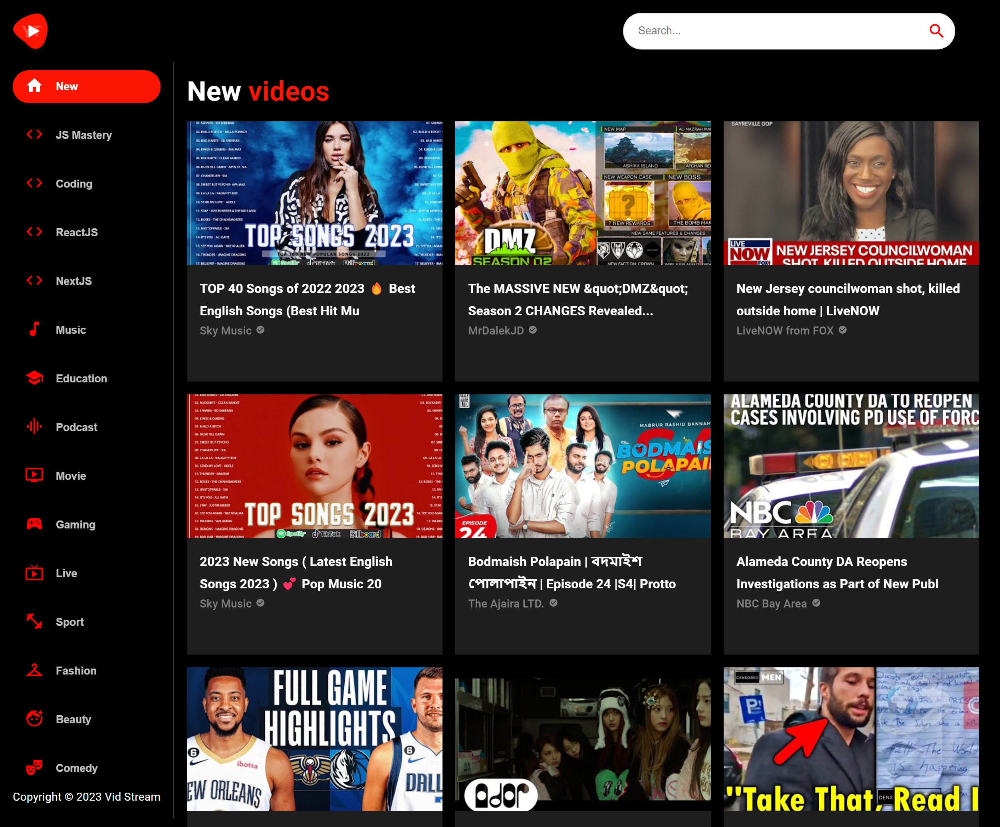

<h1 align="center"> Vid Stream - YouTube Clone </h1>

> Site is live at: https://vid-stream-gustavohdab.netlify.app/

  <a href="#-tecnologias">Technologies</a>&nbsp;&nbsp;&nbsp;|&nbsp;&nbsp;&nbsp;
  <a href="#-projeto">Project</a>&nbsp;&nbsp;&nbsp;&nbsp;&nbsp;&nbsp;</a>

## 💻 Project

The Vid Stream is a YouTube clone developed using the RapidAPI API, which provides access to YouTube videos. The project was created with the objective of practicing the consumption of external APIs and the development of a project with ReactJS.

## Features:

- Search for YouTube videos
- Select a video to watch
- Sidebar with videos related to the selected video
- Search by tags such as Podcasts, Gaming, Playlists, Live, Beauty...

  

## 🚀 Tecnologias

This project was developed using the following technologies:

React - ReactJS (for building the user interface)
JavaScript - JavaScript (for programming functionality)
React Router Dom - Library for managing routes in React
Material UI - React component library for agile and easy development
Axios - Library for making HTTP requests
